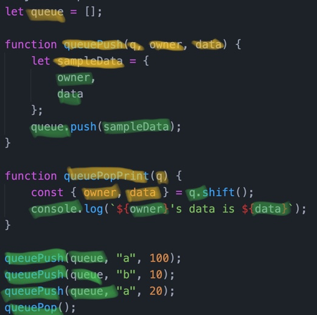

# What's the Scope?

## 요약
| Name | URL |
|:---|:---|
| holee | [Chapter 1: What’s the Scope?](https://github.com/hochan222/Everything-in-JavaScript/wiki/Chapter-1:-What%E2%80%99s-the-Scope%3F) |
| sunpark | [YDNJSY Scope & Closures - 1. What's the Scope?](https://velog.io/@cos/YDNJSY-Scope-Closures-1-Whats-the-Scope) |
| jachoi | [ydkjsy-scope-closures Chapter 1 ~ 2](https://n00bh4cker.tistory.com/136)|

## Quiz

[1.1　Compiled vs. Interpreted](#11---Compiled-vs.-Interpreted)<br>
[1.2　Compiling Code](#12---Compiling-Code)<br>
[1.3　Compiler Speak](#13---Compiler-Speak)<br>
[1.4　Cheating: Runtime Scope Modifications](#14---Cheating:-Runtime-Scope-Modifications)<br>

### 1.1 　  Compiled vs. Interpreted

1. JS는 (Compiled / Interpreted) 언어이다.

<details>
<summary> <b> :page_facing_up: 답지 </b>  </summary>
<div markdown="1">


1. JS는 (**Compiled** / Interpreted) 언어이다.

   > Our conclusion there is that JS is most accurately portrayed as a compiled language. **p.4**


</div>
</details>
<br>

### 1.2 　  Compiling Code

1. 일반적인 컴파일러 언어들의 컴파일 과정을 설명하시오.

- 1. ```_____________________```
- 2. ```_____________________```
- 3. ```_____________________```

2. 다음 코드들 중 에러가 나는 코드를 찾고, 그 이유를 설명하시오.

1)
```javascript
sayHi("Hello", "World!");

function sayHi(message, message) {
    console.log(message);
}
```

2)
```javascript
sayHello();

function sayHello() {
    let message = "Hello!";
    {
        message = "Howdy!"
        var message = "Hi!";
        console.log(message);
    }
}
```

<details>
<summary> <b> :page_facing_up: 답지 </b>  </summary>
<div markdown="1">

1. 일반적인 컴파일러 언어들의 컴파일 과정을 설명하시오.

- 1. ```Tokenizing/Lexing을 통해 코드를 작은 단위로 쪼갠다```
- 2. ```쪼갠 코드를 AST로 Parsing한다.```
- 3. ```변환한 AST를 실행가능한 코드로 변환한다.```

    > **p.4~5**

2. 다음 코드들 중 에러가 나는 코드를 찾고, 그 이유를 설명하시오.

    > 1번 코드의 경우 strict 모드를 사용한다면 중복된 변수를 잡아내겠지만, 코드에 strict 모드를 걸어놓지 않았기 때문에 정상적으로 작동이 된다. 2번 코드는 상위 스코프에서 선언된 `message`가 let으로 선언되었기 때문에 재할당이 불가능 해 오류가 발생한다. **p.8~9**

</div>
</details>
<br>

### 1.3 　  Compiler Speak

1. 아래 코드에서 사용된 모든 변수들에 대해 Target과 Source로 구분하시오.
```javascript
let queue = [];

function queuePush(q, owner, data) {
    let sampleData = {
        owner,
        data
    };
    queue.push(sampleData);
}

function queuePopPrint(q) {
    const { owner, data } = q.shift();
    console.log(`${owner}'s data is ${data}`);
}

queuePush(queue, "a", 100);
queuePush(queue, "b", 10);
queuePush(queue, "a", 20);
queuePop();
```

- Target : ```_____________________```
- Source : ```_____________________```

<details>
<summary> <b> :page_facing_up: 답지 </b>  </summary>
<div markdown="1">

1. 아래 코드에서 사용된 모든 변수들에 대해 Target과 Source로 구분하시오.



> 노란색 형광 -> Target, 초록색 형광 -> Source

</div>
</details>
<br>

### 1.4 　  Cheating: Runtime Scope Modifications

1. 런타임 도중에 스코프 설정을 바꿀 수 있는 구분 2가지는 무엇인가?

<details>
<summary> <b> :page_facing_up: 답지 </b>  </summary>
<div markdown="1">

1. 런타임 도중에 스코프 설정을 바꿀 수 있는 구문(키워드) 2가지는 무엇인가?

    > `eval`과 `with`가 있다. **p.15~16**

</div>
</details>
<br>
