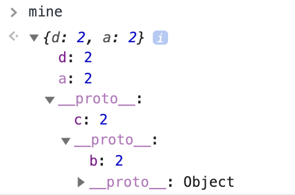

# Prototypes

## 요약
| Name | URL |
|:---|:---|
| holee | [Chapter 5: Prototypes](https://github.com/hochan222/Everything-in-JavaScript/wiki/Chapter-5:-Prototypes) |
| sunpark |  |
| dongbkim |  |
| gim | [Chapter 5: Prototypes](https://velog.io/@mkitigy/You-Dont-Know-JS-this-Object-Prototypes) |
| sohpark |  |
| nkang |  |
| yujo |  |

## Quiz

[5.1　[[Prototype]]](#51---Prototype)<br>
[5.2　"Class"](#52---Class)<br>
[5.3　(Prototypal) Inheritance](#53---Prototypal-Inheritance)<br>
[5.4　Object Links](#54---Object-Links)<br>

### 5.1 　  [[Prototype]]


[1~2] 출력 결과를 말하시오.
```js

var obj1 = {
	b: 1
};

Object.defineProperty(obj1, "b",{
	value: 2,
	writable: false
});

var obj2 = Object.create(obj1);
obj2.c = 2;

var mine = Object.create(obj2);
mine.d = 2;
mine.b = 4;

Object.defineProperty(mine, "a",{
    value: 2,
    enumerable: false
})

for (var k in mine){
    console.log("There is: " + k);//1.
}

console.log("a" in mine);//2.
console.log(mine.b, mine.hasOwnProperty("b"));//3.
mine.b++;
console.log(mine.b, mine.hasOwnProperty("b"));//4.
```

1.   

<details>
<summary> <b> :page_facing_up: 답지 </b>  </summary>
<div markdown="1">

```shell
There is: d
There is: c
There is: b
```


> the [[Prototype]] chain is consulted, one link at a time...

</div>
</details>
<br>
  
2,3,4.    

<details>
<summary> <b> :page_facing_up: 답지 </b>  </summary>
<div markdown="1">

2. true      
3. 2 false    
4. 2 false   

</div>
</details>
<br>


### 5.2 　  "Class"

> gim

#### "Class" Function

1. JS 에서는 클래스 없이 객체 생성이 가능하기 때문에, 객체 지향 관점에 위배된다. (O / X)

2. JS 에서는 오직 함수만 프로토타입 객체를 생성할 수 있다. (O / X)

3. 생성자 호출로 반환된 객체는 생성자의 프로토타입 객체라고 할 수 있다. (O / X)

4. JS 에서 인스턴스는 클래스에서 복사 되었기 때문에 그 관계가 상호 독립적이다. (O / X)

<details>
<summary> <b> :page_facing_up: 답지 </b>  </summary>
<div markdown="1">

1. JS는 클래스 없이 객체 생성이 가능하기 때문에, 객체 지향 관점에 위배된다. (O / __X__)
> JS 는 객체 지향 언어지만, 클래스 없이 직접 객체가 생성 가능한 독특한 언어이다.

2. JS 에서는 오직 함수만 프로토타입 객체를 생성할 수 있다. (__O__ / X)

3. 생성자 호출로 반환된 객체는 생성자의 프로토타입 객체라고 할 수 있다. (O / __X__)
> 생성자 호출로 반환된 객체는 인스턴스 객체이고, 그 객체는 내부에 생성자 함수의 프로토타입 객체에 대한 링크를 가지고 있다.

4. JS 에서 인스턴스는 클래스에서 복사 되었기 때문에 그 관계가 상호 독립적이다. (O / __X__)
> JS 에서 클래스-인스턴스 는 프로토타입 체인을 통해 프로퍼티를 공유하는 것이기 때문에 서로 연결되어 있다.

</div>
</details>
<br>

#### "Constructors"

1. 다음 코드를 작성했을 때, 각 호출의 예상 결과와 그 이유는? (단, 호출은 별개로 발생한다고 가정한다.)

```js
function construct(){}

var a = construct;
console.log(a.constructor); // ?

var b = construct();
console.log(b.constructor); // ?

var c = new construct();
console.log(c.constructor); // ?
```

<details>
<summary> <b> :page_facing_up: 답지 </b>  </summary>
<div markdown="1">
  
```js
// 1. Function(){}
// 2. Type Error
// 3. construct(){}
```

> 여기서 호출한 .constructor 는 프로토타입 '객체'가 아닌 프로토타입 '링크'(`__proto__`)를 통한 프로퍼티 접근이다. 이 동작은 자신과 연결된 상위 함수의 프로토타입 객체에 접근한다. (해당 프로퍼티가 발견되면 탐색 종료: shadowing)

</div>
</details>
<br>

### 5.3 　  (Prototypal) Inheritance

> sohpark

1. 다음 코드의 출력 결과를 추론하시오.
2. a1 객체의 프로토타입 체인에는 어떤 객체가 들어있을지 하단부터 순차적으로 서술하시오. 

```javascript
function Foo(name) {
  console.log(`Foo`);
  this.name = name;
}

Foo.prototype.myName = function () {
  return this.name;
};

function Bar(name, label) {
  console.log("Bar!");
  this.label = label;
  this.name = name;
}

Bar.prototype = Object.create(Foo.prototype);

var a1 = new Bar("a1", "label a1");
var a2 = new Foo("a2");

console.log(Object.getPrototypeOf(a1).constructor);
console.log(a1.myName());
```


<details>
<summary> <b> :page_facing_up: 답지 </b>  </summary>
<div markdown="1">

1.
```
Bar!
Foo
[Function: Foo]
a1
```

2.
```
// console.dir(a1.__proto__)
Foo -> Object.create를 통해 생성된 Foo 객체
	__proto__:
	myName: ƒ ()
	constructor: ƒ Foo(name)
	__proto__: Object
```
a1은 Bar을 통해 생성된 객체이기에 우선 Bar.prototype이 가장 아래 존재합니다. Bar.prototype은 Foo.prototype를 prototype으로 갖는 객체이며, Foo.prototype은 가장 최상단인 Object를 prototype으로 갖는 객체입니다. 그리고 가장 마지막은 Object.prototype이 됩니다.

결국 흐름은 이렇습니다.

a1 -> Foo instance -> Foo.prototype -> Object -> Object.prototype

</div>
</details>
<br>

### 5.4 　  Object Links

> nkang

1. Object.create(null)는 프로토타입 체인을 통해 위임받은 속성이나 함수에서 발생하는 예측하기 어려운 효과들이 발생할 가능성이 없어 데이터를 속성에 단순히 저장만 하기 위해 주로 사용되며 `_________________`라고 불린다. 

<details>
<summary> <b> :page_facing_up: 답지 </b>  </summary>
<div markdown="1">

dictionary

</div>
</details>
<br>

2. 다음 코드의 결과는?
```
var anotherObject = {
	cool: function(word) {
		console.log( "cool!" + ( word || '') );
	}
};

var myObject = Object.create( anotherObject );

myObject.doCool = function() {
	this.cool(", not really..."); 
};

myObject.cool(); // a)___________________
myObject.doCool(); // b)___________________
```
<details>
<summary> <b> :page_facing_up: 답지 </b>  </summary>
<div markdown="1">
a) cool!
b) cool!, not really...

</div>
</details>
<br>
